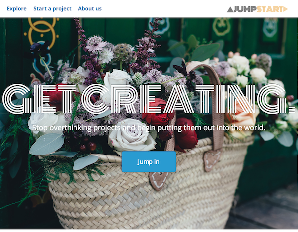
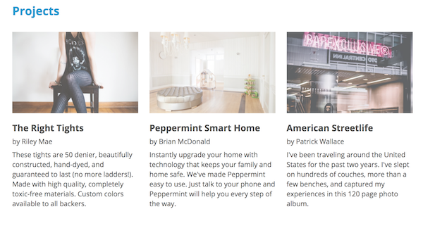
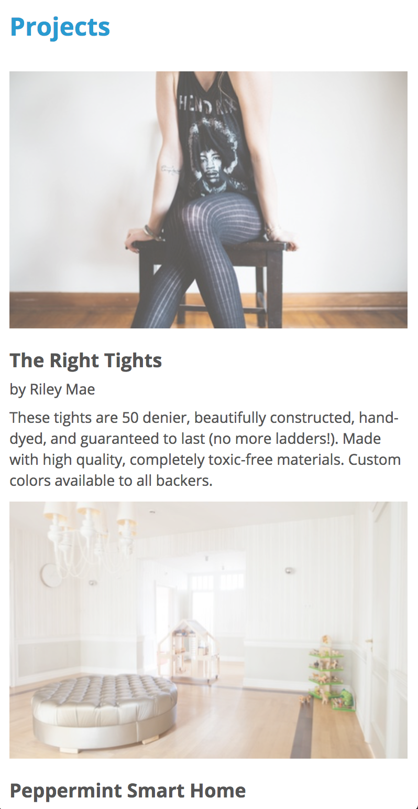

# Jumpstart
Webpage focusing on jQuery, JavaScript and CSS

<a target="_blank" rel="noopener noreferrer"  href="https://d3izyhvt2yix49.cloudfront.net/">AWS Website</a>

<b>Overall:</b>
  <li>Specifications: Wireframe was provided. However, I did not complete the project using primarily Bootstrap as I preferred additional practice in Flexbox and have completed many projects with Bootstrap.</li>
  <li>Concept: the webpage focused on completing projects and needing ideas to get started. It incorporates art, photography and more.</li>

 
<b>Features:</b>
  <li>CSS hover on images was informational and I have taken that knowledge to other projects.</li>
  <li>Overflow combined with hover and zoom placed on the images. This created a magnifying effect without letting the picture overflow outside it's container.</li>
  <li>Opacity for an additional effect on the images on hover.</li>
  <li>Slicks' carousel with jQuery to create multiple images to scroll across page. Very customizable and would love to use in the future.</li>
  <li>Bootstrap for standard, reactive button design.</li>

 

<b>Difficulties:</b>
  <li>The carousel from Slick created the most difficulty for Jumpstart. Since Slick blended newly learned jQuery aspects while using a script from Slick. This lead to confusion as I simply thought I was incorporating the code incorrectly. Although, it ended up being that their script links no longer worked. While this hurtle was frustrating, I learned to triple check links if everything else seems fine. </li>
  <li>Working with overflow of images and learning to maniuplate them in a new way</li>

  
  <h4>This is one of four images that are looped through using Slick.js carousel. The photos are a large focus of the website, located within the Jumbotron</h4>
   
  
  <h4>All photos have a hover effect. When the user hovers, the image is zoomed in slightly and is changed from .8 opacity to 1. With the overflow set to none, the zoom effect does not the position of the photo. Possibly one of my favorite effects that is simple, yet, looks nice.</h4>
   
  
  <h4>Showing the responsive website design from desktop to mobile</h4>
